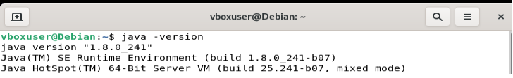
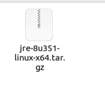
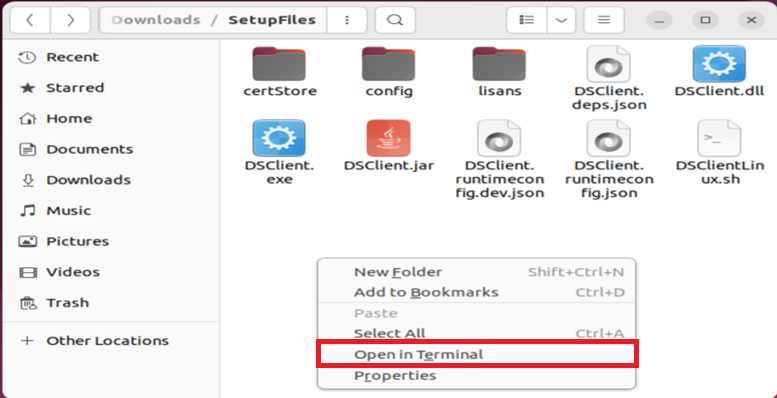
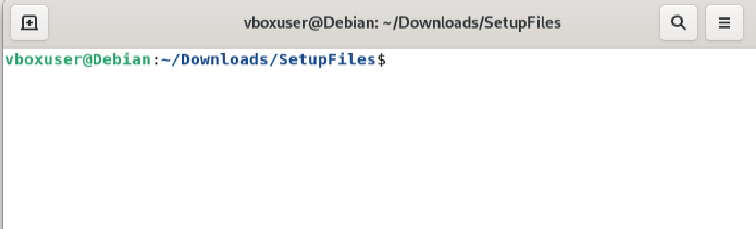
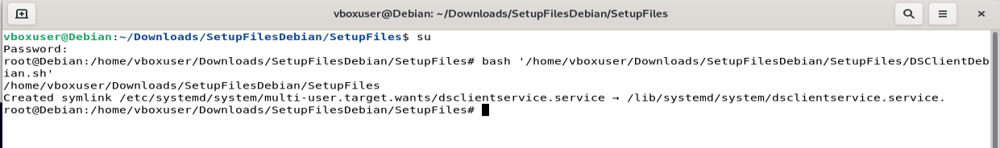
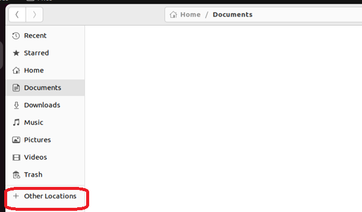
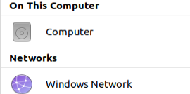
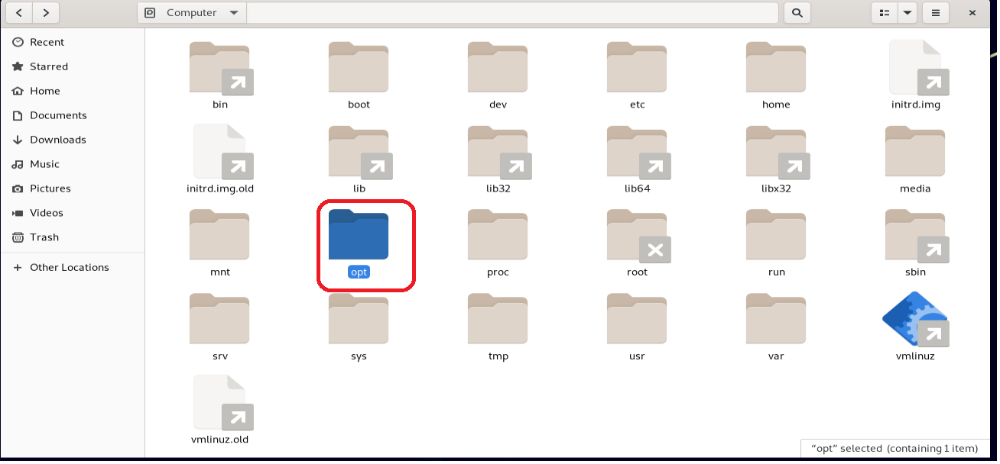
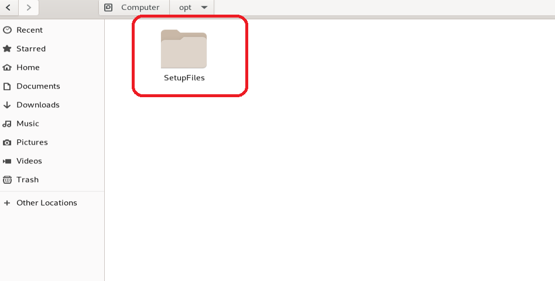

## Linux Cihazlar İçin Kurulum

### 1- Gereksinimler

Dijital İmza uygulamasını cihazınıza kurmadan önce aşağıda belirtilen Java kütüphanesinin cihazınızda kurulu olması gerekmektedir.

Cihazınızda JAVA'nın yüklü olup olmadığını yüklü  ise hangi versiyonda olduğunu öğrenmek için termina açıp aşağıdaki kodu giriniz.

```sh 
	java -version
```

Ekrandakine benzer bi görüntü oluşacaktır.



Eğer java cihazınızda yüklü ise versiyon burada görülecektir. Bu versiyonun 1.8.0_ 241 veya üzeri bir versiyon olması faydalı olacaktır.

Eğer Java yüklü değilse aşağıdaki yükleme yönergelerinden faydalanabilirsiniz.

JRE (Java Runtime Environment) . Bu kütüphaneyi aşağıdaki linkten cihaz türünüze uygun olanı seçerek indirebilirsiniz

İndirme sayfası : https://www.java.com/tr/download/manual.jsp

Yukarıdaki linkten Java'yı indirdikten sonra , seçiminize bağlı olarak , indirilenler klasörünüzde görseldekine benzer bir kurulum dosyası olacaktır. Bu kurulum dosyasını arşivden çıkarın.



Arşivden çıkardıktan sonra indirilenler klasöründe boş bir kısma sağ tıklayarak terminal açın ve öncelikle şu komutu girin.

```sh 
	su
```

Ardından size parolanız sorulacaktır, parolanızı girdikten sonra sıradaki komutla devam edin.

```sh 
	update-alternatives --install /usr/bin/java java /home/kullanıcıAdınız/Downloads/jre-8u241-linux-x64/jre1.8.0_241/bin/java 100
```

Bu komutu oluşturmak için 

```sh 
	update-alternatives --install /usr/bin/java java 
```

kısmından sonra , indirilenler klasöründe arşiveden çıkarmış olduğunuz java kurulum klasörüne girin ve bin içerisindeki Java dosyasını teminale sürükleyin.
Ardından 100 yazın ve kodu uygulayın.

### 2- Dijital İmza Uygulamasının Kurulumu - Debian

Dijital İmza uygulamasının kurulumu için Linux (Debian) cihazlarda bulunan terminal uygulamasından faydalanacağız.

Bunun için SetupFiles klasörünüzde boş bir alana sağ tıklayın ve gelen menüden "Terminalde Aç" veya "Open in Terminal"
seçeneğini seçin.




Terminali açtığınızda aşağıdaki görsele benzer bir ekran gelecektir. 



Bu ekranda şu komutu yazın :
```sh 
	su
```
Ardından gelen parola ekranında parolanızı girin.Bu kuurulum sırasında gereken izinleri sağlayacaktır.

Bu ekranda şu komutu yazın :
```sh 
	bash
```

Ve bir boşluk bırakın

Ardından Setup Files klasöründeki DSClientDebian.sh dosyasını tutup bu ekrana sürükleyin

```sh 
	bash /home/username/Downloads/SetupFiles/DSClientDebian.sh
```
Kod satırı yukardaki örneğe benzer şekilde görülecektir. Tek fark dosya konumunuz olacaktır.
Kod satırının sonudaki 1 adet boşluğu silmeniz gerekmektedir.
Ardından Enter'a basarak komutu uygulayın.




İşlem başarılı olması durumunda Terminal görüntüsü yukardaki görseldeki gibi olacak ve terminal bir alt satıra geçecektir.
Herhangi bir sorunla karşılaşmanız halinde program kendi işlem ve hata kayıtlarını oluşturmaktadır. Bu dosyalardaki kayıt mesajlarını iletmeniz durumunda sorunlarınız daha hızlı çözüme kavuşacaktır.


### 3 - Log Kayıtlarına  Nasıl Ulaşılır - Debian

Örnek Debian11 üzerinden anlatılmıştır.

Yan menüden Files'ı açın.


Açılan pencerede other locations’u seçin.




Computer’i açın



opt'yi açın.



SetupFiles 'ı açın




Setupfiles içerisinde “servicelog.err.txt” dosyası mevcuttur.
Kurulum sırasında veya bilgisayarınızı yeniden başlattıktan sonra dijital imza servisi herhangi bir hata ile karşılaşırsa buraya kayıt edecektir.
Bu dosyayı çift tıklayarak text editör ile açabilirsiniz.

Programa ait hata dışı kayıtlar yine aynı klasörde bulunan “servicelog.out.txt” dosyasında tutulmaktadır.

-
Dijital imza servisini  durdurmak zorunda kalırsanız  şu adımları izleyebilirsiniz.

Teminali açın
Önce yetki komutunu yazın ve parolanızı girin:

```sh 
	su
```

Servisi durdurmak için :  

```sh 
	 systemctl stop  dsclientservice.service
```
komutunu uygulayın.

Sizden parolanızı isteyebilir, parolanızı girin.
 
Servisi kapatmak için durdurma komutunu uyguladıktan sonra
```sh 
	 systemctl disable  dsclientservice.service
```
komutunu uygulayın.

Servisi tamamen cihazınızdan silmek için kapatma komutunu uyguladıktan sonra
```sh 
	 rm -r /lib/systemd/system/dsclientservice.service
```
komutunu ve bu kaldırma işlemininden kaynaklı değişikliklerin  kaydedilmesi için

```sh 
	systemctl daemon-reload
```

bu komutu uygulayın
